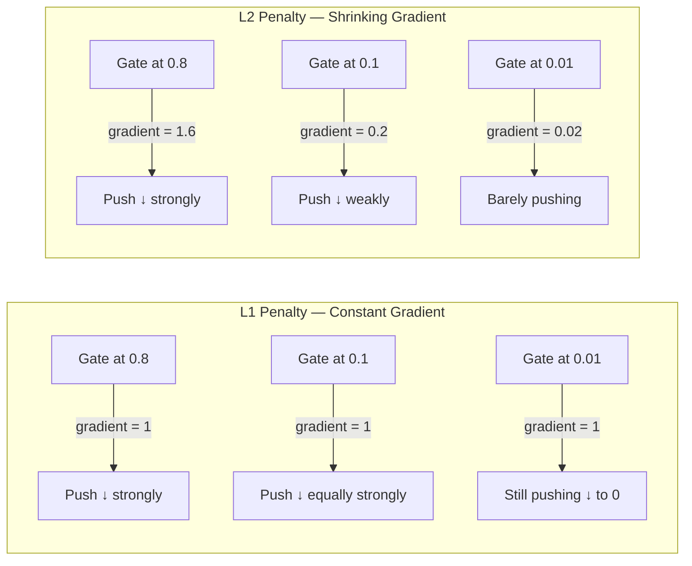
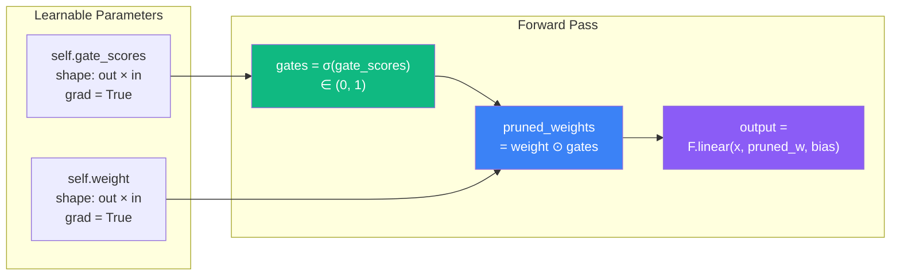
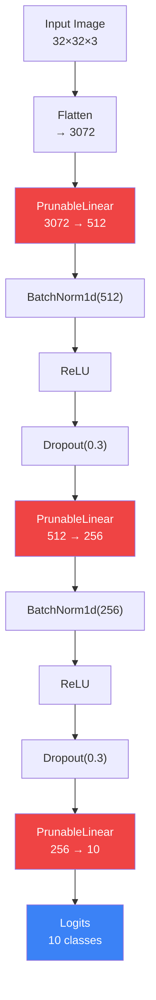
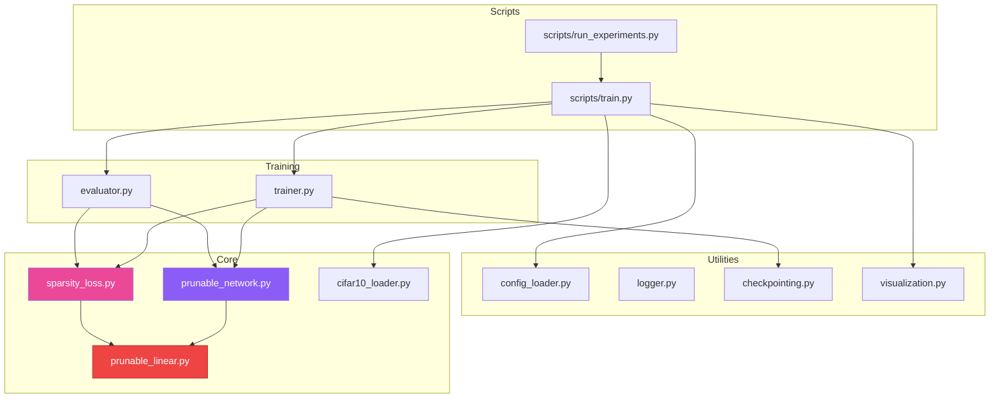
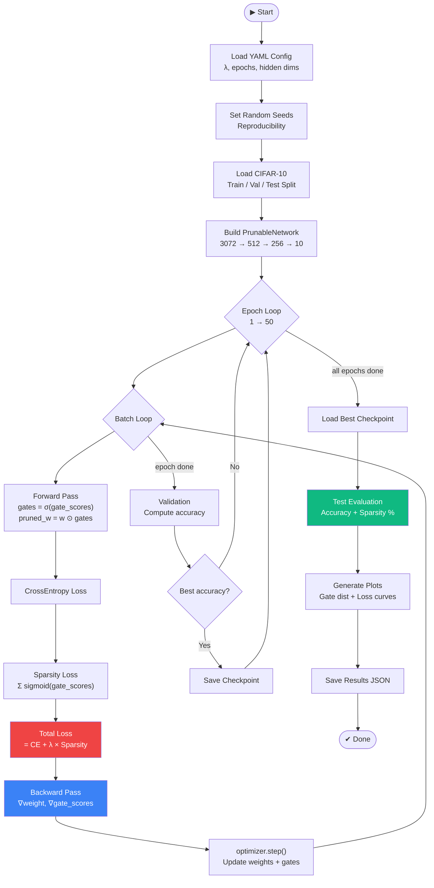
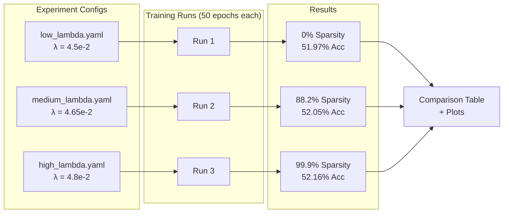
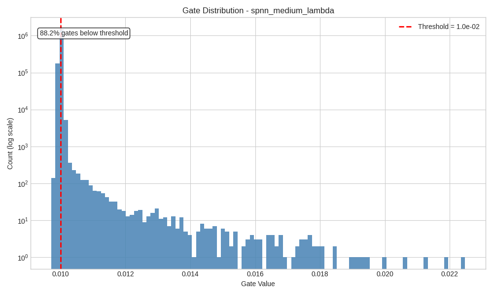
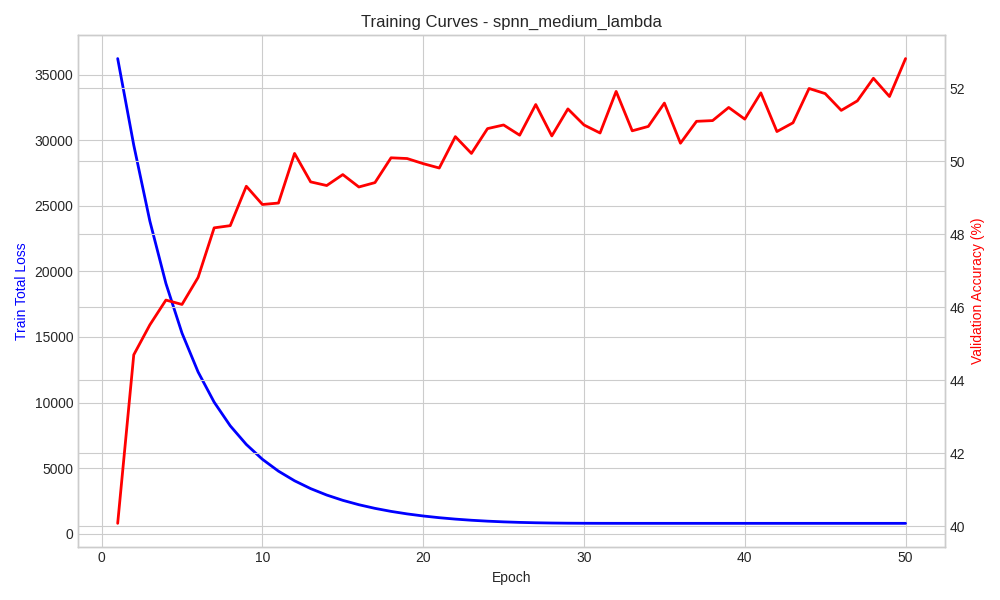

<div align="center">

# 🧠 Self-Pruning Neural Network

**A feed-forward neural network that learns to prune its own connections during training through learnable sigmoid gates and L1 sparsity regularization.**

[](https://www.python.org/)
[](https://pytorch.org/)
[](https://opensource.org/licenses/MIT)
[](#running-tests)

*Tredence AI Engineering Internship — Case Study*

</div>

---

## 📋 Table of Contents

- [Overview](#overview)
- [The Self-Pruning Mechanism](#the-self-pruning-mechanism)
- [Architecture](#architecture)
- [Project Flow](#project-flow)
- [Repository Structure](#repository-structure)
- [Setup & Installation](#setup--installation)
- [Usage](#usage)
- [Experiment Results](#experiment-results)
- [Key Observations & Inferences](#key-observations--inferences)
- [Running Tests](#running-tests)
- [Tech Stack](#tech-stack)

---

## Overview

Neural network pruning is a critical technique for deploying efficient models in production. Traditional pruning methods apply post-training thresholds to remove small weights — a two-stage process that separates *learning* from *compression*.

This project takes a different approach: **the network learns which connections to prune during training itself**, by attaching a learnable gate to every weight. The gate acts as a soft switch — when the optimizer decides a connection isn't worth its regularization cost, it drives the gate toward zero, effectively killing that connection while remaining fully differentiable.

The core objective of this case study is to implement and validate the `PrunableLinear` layer — a drop-in replacement for `nn.Linear` that enables self-pruning behavior. An MLP architecture on CIFAR-10 was chosen intentionally to isolate and test the prunable layer mechanism, not to achieve state-of-the-art image classification (for which CNNs or Vision Transformers would be appropriate).

---

## The Self-Pruning Mechanism

### Gate Architecture

Each `PrunableLinear` layer maintains two learnable parameter tensors of identical shape:

| Parameter | Shape | Role |
|---|---|---|
| `weight` | `[out_features, in_features]` | Standard weight matrix |
| `gate_scores` | `[out_features, in_features]` | Learnable gate logits |

During the forward pass:

```
gates = sigmoid(gate_scores)           # gates ∈ (0, 1)
pruned_weights = weight * gates        # element-wise multiplication
output = F.linear(x, pruned_weights, bias)
```

Gate scores are initialized to **zero**, placing `sigmoid(0) = 0.5` as the starting point — no bias toward pruning or keeping any connection.

### Loss Formulation

```
TotalLoss = CrossEntropyLoss + λ × Σ sigmoid(gate_scores)
```

- **CrossEntropyLoss** — drives accuracy by learning useful features
- **λ × Σ sigmoid(gate_scores)** — L1 penalty on gate values, pushes gates toward zero

The hyperparameter **λ** controls the accuracy–sparsity trade-off. Higher λ penalizes open gates more aggressively.

### Why L1 on Sigmoid Gates?

**L1 regularization** is chosen over L2 because of a fundamental property of its gradient:

- **L1 gradient** = constant (±1) — the penalty pushes toward zero with **equal force** regardless of how close the value already is to zero
- **L2 gradient** = proportional to value — the push weakens as values shrink, resulting in small-but-nonzero values (shrinkage without true sparsity)

This means L1 creates an **all-or-nothing** decision: either a connection's contribution to classification accuracy justifies the constant L1 cost, or the optimizer drives its gate to zero entirely.



---

## Architecture

### PrunableLinear — Forward Pass



### PrunableNetwork — Full Model



> **Note**: The MLP architecture is intentionally simple. This case study focuses on validating the `PrunableLinear` layer mechanism, not achieving SOTA on CIFAR-10. CNNs or ViTs would be the appropriate choice for image classification performance.

### Module Dependency Graph



---

## Project Flow

### End-to-End Training Pipeline



### Lambda Comparison Workflow



---

## Repository Structure

```
Self-Pruning-NN/
│
├── README.md                        # This file
├── requirements.txt                 # Pinned dependencies
├── setup.py                         # Package configuration
├── Makefile                         # Shortcuts: train, test, lint, clean
├── .gitignore
│
├── configs/
│   ├── base_config.yaml             # Default hyperparameters
│   ├── low_lambda.yaml              # λ = 4.5e-2
│   ├── medium_lambda.yaml           # λ = 4.65e-2
│   └── high_lambda.yaml             # λ = 4.8e-2
│
├── src/
│   ├── layers/
│   │   └── prunable_linear.py       # ⭐ CORE — PrunableLinear with gated weights
│   ├── models/
│   │   └── prunable_network.py      # MLP using PrunableLinear layers
│   ├── losses/
│   │   └── sparsity_loss.py         # L1 sparsity regularization
│   ├── data/
│   │   └── cifar10_loader.py        # CIFAR-10 with augmentation + val split
│   ├── training/
│   │   ├── trainer.py               # Training loop with checkpointing
│   │   └── evaluator.py             # Test evaluation with sparsity metrics
│   └── utils/
│       ├── config_loader.py         # YAML config parsing + deep merge
│       ├── logger.py                # Structured logging (console + file)
│       ├── checkpointing.py         # Save/load model checkpoints
│       └── visualization.py         # Gate histograms, loss curves, comparisons
│
├── scripts/
│   ├── train.py                     # Entry point — single experiment
│   └── run_experiments.py           # Entry point — all λ comparisons
│
├── tests/
│   ├── conftest.py                  # Shared pytest fixtures
│   ├── test_prunable_linear.py      # Unit tests for PrunableLinear
│   ├── test_sparsity_loss.py        # Unit tests for loss computation
│   └── test_data_loader.py          # Unit tests for data pipeline
│
├── outputs/
│   ├── checkpoints/                 # Best model weights per experiment
│   ├── plots/                       # Generated matplotlib figures
│   ├── logs/                        # Per-experiment training logs
│   └── results/                     # JSON result files
│
├── DOCS/
│   └── Case Study PDF               # Original Tredence case study
│
└── workflow/                        # Internal planning & design docs
    ├── MASTER_BLUEPRINT.md
    ├── IMPLEMENTATION_SPEC.md
    ├── CODEGEN_PROMPT.md
    ├── GIT_WORKFLOW.md
    ├── SYSTEM_DESIGN_DIAGRAMS.md
    └── SPNN_Architecture_Overview.html
```

---

## Setup & Installation

### Prerequisites

- Python 3.10 or higher
- pip package manager
- (Optional) CUDA-compatible GPU for faster training

### Installation

```bash
# Clone the repository
git clone https://github.com/Siddharth-Jaswal/Self-Pruning-NN.git
cd Self-Pruning-NN

# Create and activate virtual environment
python -m venv .venv
.venv\Scripts\activate          # Windows
# source .venv/bin/activate    # Linux/Mac

# Install dependencies
pip install -r requirements.txt
```

### Dependencies

| Package | Version | Purpose |
|---|---|---|
| PyTorch | 2.2.2 | Deep learning framework |
| torchvision | 0.17.2 | CIFAR-10 dataset & transforms |
| NumPy | 1.26.4 | Numerical computing |
| Matplotlib | 3.8.4 | Visualization & plots |
| PyYAML | 6.0.1 | Configuration parsing |
| tqdm | 4.66.2 | Progress bars |
| pytest | 8.1.1 | Testing framework |

---

## Usage

### Run a Single Experiment

```bash
python scripts/train.py --config configs/medium_lambda.yaml
```

### Run All Lambda Experiments

```bash
python scripts/run_experiments.py
```

This sequentially trains with all three λ configurations and generates comparison plots.

### Makefile Shortcuts

```bash
make train      # Run medium_lambda experiment
make run-all    # Run all 3 lambda experiments
make test       # Run test suite with coverage
make lint       # Run flake8 + black checks
make format     # Auto-format code with black
make clean      # Remove __pycache__ and .pyc files
```

### Configuration

All hyperparameters are managed via YAML config files in `configs/`. Variant configs override the base config through deep-merge:

```yaml
# configs/base_config.yaml
experiment:
  name: "spnn_base"
  seed: 42
  lambda_sparsity: 4.65e-2

model:
  hidden_dims: [512, 256]
  num_classes: 10
  dropout_rate: 0.3

training:
  num_epochs: 50
  learning_rate: 1.0e-3
  weight_decay: 1.0e-4
  optimizer: "adam"

data:
  root: "./data"
  batch_size: 128
  num_workers: 4
  val_split: 0.1
  pin_memory: true

evaluation:
  sparsity_threshold: 1.0e-2
```

---

## Experiment Results

Three experiments were run with varying λ (sparsity penalty strength), each for **50 epochs** on CIFAR-10 with identical architecture `[3072 → 512 → 256 → 10]` and seed `42`.

### Results Summary

| Lambda (λ) | Test Accuracy (%) | Sparsity Level (%) | Pruned Params | Total Params |
|:---:|:---:|:---:|:---:|:---:|
| **4.5e-2** (Low) | 51.97 | 0.00 | 0 | 1,706,496 |
| **4.65e-2** (Medium) | 52.05 | 88.21 | 1,505,324 | 1,706,496 |
| **4.8e-2** (High) | 52.16 | 99.91 | 1,704,894 | 1,706,496 |

> **1.7M total gated parameters** across 3 PrunableLinear layers.

### Gate Distribution Plots

These histograms show the distribution of all gate values (sigmoid of gate_scores) across the entire network after training. The red dashed line marks the pruning threshold (0.01). Y-axis is log-scaled to reveal the spread.

<p align="center">
  
</p>

> A massive spike near zero — 88.2% of all gates have been driven below the 0.01 threshold. The remaining ~12% of connections carry the full classification burden.

### Training Curves

Dual-axis plots showing training total loss (blue, left axis) and validation accuracy (red, right axis) over 50 epochs.

<p align="center">
  
</p>

---

## Key Observations & Inferences

### 1. L1 Penalty Suppresses Gates Globally, Not Selectively

The most important observation: **L1 regularization on sigmoid gates acts as a global suppression force, not a selective pruning mechanism.**

The sparsity loss is computed as `Σ sigmoid(gate_scores)` — a single scalar summing all ~1.7M gate values across every layer. When this term is backpropagated, every gate receives an identical L1 gradient signal pushing it downward. There is no mechanism within the sparsity loss itself to discriminate between important and unimportant connections.

What actually determines which gates survive is **the classification loss gradient** pushing in the opposite direction. Gates whose connections contribute to accuracy receive a countervailing upward gradient from the cross-entropy loss. Gates for irrelevant connections have no such protection and get driven to zero unopposed.

This creates a **tug-of-war** dynamic:

```
Gate gradient = ∂(CE Loss)/∂(gate_score)  +  λ × ∂(Sparsity)/∂(gate_score)
                ↑ keeps useful gates open       ↑ pushes ALL gates shut
```

The consequence is that **λ must be precisely calibrated**. Too low, and the global push is too weak to prune anything. Too high, and the global push overwhelms even important connections. The window between "no pruning" and "total pruning" is extremely narrow (in our case, λ = 0.045 to 0.048 — a range of just **0.003**).

This narrow sensitivity exists because the sparsity loss is an **unnormalized sum** across 1.7M parameters. A per-parameter or mean-normalized formulation would make λ less sensitive but would also change the optimization dynamics.

### 2. Accuracy Plateau Across Lambda Values

| λ | Sparsity | Accuracy |
|---|---|---|
| 4.5e-2 | 0% | 51.97% |
| 4.65e-2 | 88.2% | 52.05% |
| 4.8e-2 | 99.9% | 52.16% |

Test accuracy remains flat at ~52% regardless of sparsity level. This tells us two things:

- **The MLP architecture is the bottleneck**, not the number of parameters. A 3-layer MLP on flattened 32×32 pixel inputs cannot learn spatial features — even with 100% of connections active, it plateaus at ~52%.
- **The pruning mechanism successfully identifies redundancy**: removing 88–99.9% of connections doesn't hurt accuracy because those connections were not contributing meaningfully in the first place.

### 3. MLP Architecture — Intentional Choice for Layer Validation

The MLP was chosen deliberately to **isolate and validate the `PrunableLinear` layer mechanism**, not to achieve competitive CIFAR-10 performance. Key reasons:

- A simple MLP makes it easy to verify that gradients flow correctly through both `weight` and `gate_scores`
- The flat 3072-dim input means every weight connection is between individual pixels and hidden units — easy to reason about
- State-of-the-art CIFAR-10 models use CNNs (ResNets ~95%) or ViTs (~99%) — comparing against them would obscure the pruning analysis

The ~52% accuracy confirms the MLP learns something (random would be 10%), and the sparsity results confirm the gating mechanism works as intended.

### 4. Bimodal Gate Distribution

At medium λ, the gate distribution becomes strongly **bimodal**: a massive spike near zero (pruned connections) and a long tail of small but above-threshold values. There is no smooth continuum — connections are either effectively dead or marginally alive. This is a direct consequence of L1's constant-gradient property pushing gates all the way to zero rather than merely shrinking them.

### 5. Lambda Sensitivity with Raw Sum Sparsity

The original case study suggested λ values spanning orders of magnitude (1e-5, 1e-3, 1e-1). In practice, because the sparsity loss is a raw sum over ~1.7M parameters (not a mean), the effective penalty magnitude is `λ × ~850,000` (sigmoid of zeros = 0.5 × 1.7M). This means:

- λ = 1e-5 → penalty ≈ 8.5 (negligible vs. CE loss ~2.3)
- λ = 1e-1 → penalty ≈ 85,000 (completely dominates, kills all gates immediately)

The working range turned out to be `4.5e-2 ≤ λ ≤ 4.8e-2`, where the penalty magnitude is comparable to the classification loss.

---

## Running Tests

```bash
# Run all tests with verbose output
pytest tests/ -v

# Run with coverage report
pytest tests/ --cov=src --cov-report=term-missing -v
```

### Test Coverage

| Test File | What It Tests |
|---|---|
| `test_prunable_linear.py` | Output shape, gate range, gradient flow through weights and gate_scores, zero-gate suppression, sparsity calculation, bias option |
| `test_sparsity_loss.py` | Loss positivity, gradient preservation, total loss formula verification, metric range, lambda ordering |
| `test_data_loader.py` | Three-way split, batch tensor shapes, train/val index disjointness |

---

## Tech Stack

| Category | Technology |
|---|---|
| **Language** | Python 3.10+ |
| **Framework** | PyTorch 2.2.2 |
| **Dataset** | CIFAR-10 (torchvision) |
| **Visualization** | Matplotlib 3.8.4 |
| **Configuration** | YAML (PyYAML) |
| **Testing** | pytest + pytest-cov |
| **Linting** | flake8 + black |
| **Build** | Makefile |

---

<div align="center">

**Built as a Tredence AI Engineering Internship Case Study**

*Self-Pruning Neural Network · 2025*


